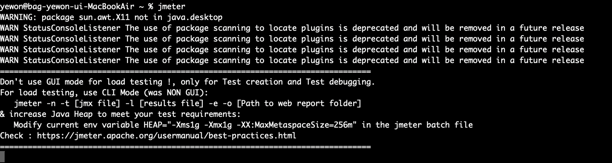
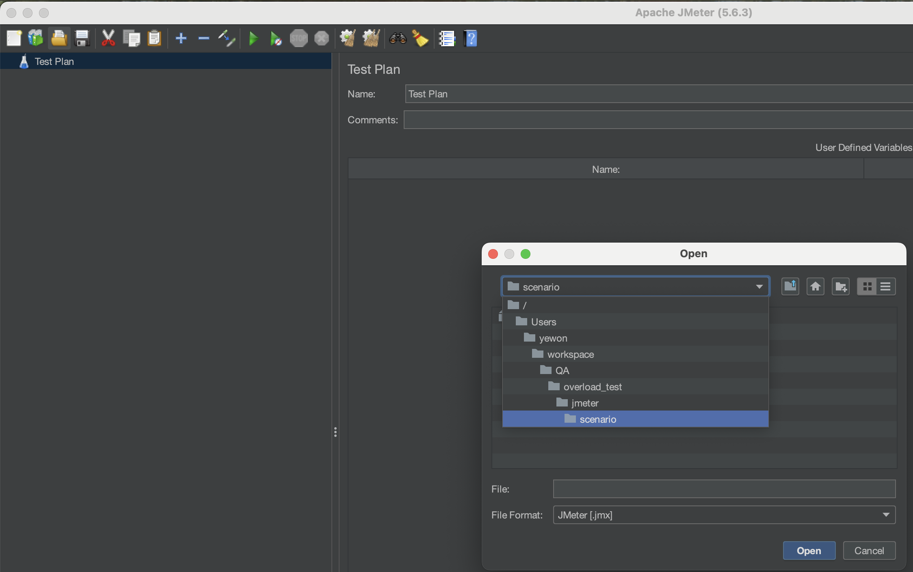
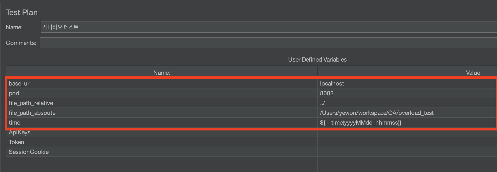

# overload_test
<a href="[https://github.com/yewon4540/overload_test?tab=readme-ov-file#%EA%B0%9C%EB%85%90](https://yedong4540.tistory.com/10)" target="_blank">블로그 링크</a>

## 프로젝트 구조
```
.
├── Course_registration_flask # 과부하 테스트를 위한 예시 Web
├── Course_registration_java # 과부하 테스트를 위한 예시 Web
├── git_upload # git readme 첨부파일 디렉토리
├── jmeter # jmeter 설정 및 구조 예시 디렉토리
├── locust # locust 설정 및 구조 예시 디렉토리
└── README.md
```
---

## 프로젝트 설명 
이 프로젝트는 **Locust** 및 **JMeter**를 활용하여  
웹 서비스의 **부하 테스트(Load Test)** 및 **시나리오 기반 성능 검증**을 수행하는 예시를 제공합니다.  
각 도구별 설정 구조, 테스트 스크립트, 실행 방법을 간단히 정리하였습니다.

---
## 개념
### 과부하 테스트란?
과부하(Load) 테스트는 **시스템이 동시에 처리할 수 있는 최대 부하를 측정**하는 테스트입니다.  
일정 시간 동안 다수의 사용자가 동시에 요청을 보낼 때,  
응답 속도, 처리량(TPS), 오류율 등의 **성능 지표**를 통해 서버의 한계점과 병목 구간을 파악합니다.

> 목적:
> - 웹 서비스의 안정성 및 확장성 검증  
> - 임계 부하(최대 처리 가능 사용자 수) 확인  
> - 리소스 최적화 및 병목 개선 근거 확보

### 과부하 테스트 도구의 종류
- Jmeter : Java로 구성 / GUI 기반 / 다소 무거움 / UI가 직관적임
- Locust : Python으로 구성 / 코드 기반 / 가벼움 / 커스텀이 자유로우나, 손수 해야함

### Jmeter
- **JMeter란:**  
  Apache Software Foundation에서 개발한 오픈소스 부하 테스트 도구이다.
  GUI 기반으로 HTTP, JDBC, FTP 등 다양한 프로토콜을 지원하며,  
  복잡한 시나리오를 시각적으로 구성할 수 있다.

- **활용 예시:**  
  - 로그인, 회원가입, 게시물 작성 등 **HTTP 요청 테스트**  
  - 데이터베이스 쿼리 성능 측정 (JDBC Sampler)  
  - 여러 스레드 그룹을 이용한 **시나리오별 동시 사용자 부하 분리 테스트**  
  - 결과 리포트를 통한 응답시간/에러율 시각화  
  - 

### Locust
- **Locust란:**  
  Python 기반의 오픈소스 부하 테스트 도구로,  
  **테스트 시나리오를 코드(Python)로 작성**할 수 있는 것이 가장 큰 특징을 가짐.  
  사용자가 직접 행동(로그인 → 페이지 이동 → 요청 등)을 정의할 수 있으며,  
  CLI 모드 또는 웹 UI 모드에서 손쉽게 부하를 제어할 수 있다.

- **특징 및 장점:**  
  - 코드 기반으로 **복잡한 시나리오를 간결하게 작성** 가능  
  - 단일 머신 또는 다중 분산 실행 지원  
  - 실시간 모니터링 (Web UI)  
  - CI/CD 파이프라인 통합 용이  

--- 
## 각 폴더별 실행 방법

1. java spring (Course~~_java)
  - 기본 포트 : `8082`
```bash
cd Course_registration_java
mvn spring-boot:run
```

2. python flask (Course~~_flask)
  - 기본 포트 : `5001`
```bash
cd Course_registration_flask
python app.py
```

```bash
# 가상환경 이용 시 
python -m venv .venv
source .venv/bin/activate
## window
./.venv/Scripts/activate.bat
```

3. jmeter
  - 설치 : https://jmeter.apache.org/download_jmeter.cgi
    
  - jmeter 실행 (GUI)
    - mac 예시
        
  - jmeter 실행 후 시나리오 파일 load
    
  - variable 부분 변수(ex. 경로) 맞춰준 뒤 실행
    

4. locust
  - locust 및 의존성 설치
    - 가상환경에서 실행 예시
```bash
cd locust
python -m venv .venv
source .venv/bin/activate
pip install -r requirements
```
  - locust Script 실행
```bash
cd locust
bash locust.sh
```
  - locust Web UI 실행
```bash
cd locust
bash UI_mode_locust.sh
```
  - 직접 실행
```bash
cd locust
locust -f scenario/locustfile.py --headless --host=http://localhost:5001 -u 5 -r 2 -t 10s --csv=result/test
```
